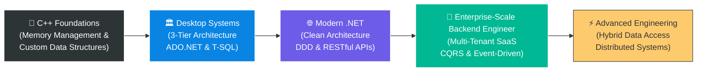

<!-- Header Banner with Animated Text -->
<div align="center">
  
  <!-- Animated Typing SVG -->
  <a href="https://git.io/typing-svg"></a>

  <!-- Profile Views Counter -->
  <br/>
  
  
</div>

---

## 👨‍💻 About Me

```javascript
const mohamed = {
    role: "Backend Developer",
    specialization: ".NET & Enterprise-Scale Architecture",
    location: "Egypt 🇪🇬",
    education: "Computer Science",
    currentFocus: "Multi-Tenant SaaS & Clean Architecture",
    
    skills: {
        languages: ["C#", "C++", "PL/pgSQL", "T-SQL"],
        backend: ["ASP.NET Core", ".NET", "Clean Architecture", "DDD", "CQRS","RestFul API"],
        dataAccess: ["Entity Framework Core", "Dapper", "ADO.NET"],
        databases: ["PostgreSQL", "SQL Server", "Redis"],
        patterns: ["Repository Pattern", "SOLID", "Event-Driven Architecture"],
        devops: ["Docker", "AWS SES", "Hangfire", "Git/GitHub", "SignalR"],
        testing: ["xUnit", "FluentAssertions", "Testcontainers", "FluentValidation"],
        caching: ["Redis", "FusionCache", "Distributed Caching"],
        logging: ["Serilog"]
    },
    
    architectureExpertise: [
        "Multi-Tenant SaaS Platforms",
        "Clean Architecture",
        "Domain-Driven Design (DDD)",
        "CQRS with MediatR",
        "Event-Driven Systems",
        "Hybrid Data Access Strategies"
    ],
    
    funFact: "I started with C++ console games and evolved to building enterprise-grade SaaS platforms!"
};
```

---

## 🛠️ Tech Stack

<div align="center">

### Languages


### Frameworks & Architecture


### Data Access & ORM


### Databases & Caching


### DevOps & Cloud


### Testing & Quality


### Logging & Monitoring


</div>

---

## 🚀 Featured Projects

<table>
<tr>
<td width="50%">

### 🏢 ERP Engine - Multi-Tenant SaaS
**Enterprise Resource Planning System**


**Architecture & Patterns:**
- ✅ Clean Architecture (Onion Pattern)
- ✅ Domain-Driven Design (DDD)
- ✅ MediatR For Events
- ✅ Event-Driven Architecture
- ✅ Repository Pattern

**Key Features:**
- ✅ Multi-Tenant SaaS Platform
- ✅ 70+ Domain Entities
- ✅ Hybrid Data Access (EF Core + Dapper)
- ✅ 63 PostgreSQL Stored Functions
- ✅ JWT + Argon2id Security
- ✅ 3-Tier Caching (L1 Memory + L2 Redis)
- ✅ 100% Integration Test Coverage

**Tech Stack:**
- Backend: .NET 10, ASP.NET Core Web API
- Database: PostgreSQL 17, PL/pgSQL
- Caching: Redis, FusionCache
- ORM: Entity Framework Core (Writes) + Dapper (Reads)
- Testing: xUnit, Testcontainers, FluentAssertions
- Validation: FluentValidation
- Logging: Serilog

</td>
<td width="50%">

### 🎙️ OSV - AI Voice Orchestrator
**Real-Time AI Integration Platform**


**Architecture:**
- ✅ Event-Driven Architecture
- ✅ Real-Time Communication (SignalR)
- ✅ Webhook Processing

**Key Features:**
- ✅ Retell AI Voice Integration
- ✅ Cal.com Bidirectional Sync
- ✅ Live Dashboard (Zero-Refresh UI)
- ✅ Timing-Attack Safe Authentication
- ✅ Sub-50ms Webhook Response
- ✅ Hybrid Data Access (EF Core + Dapper)

**Tech Stack:**
- Backend: ASP.NET Core 10, SignalR
- Database: PostgreSQL 17
- Data Access: Entity Framework Core, Dapper
- Cloud: AWS SES (Email Service)
- Frontend: Tailwind CSS, Razor Pages
- DevOps: Docker, Docker Compose

</td>
</tr>
<tr>
<td width="50%">

### 🚗 DVLD System
**Government License Management**


**Architecture:**
- ✅ 3-Tier Architecture
- ✅ Database-First Design
- ✅ State Machine Pattern
- ✅ ADO.NET Data Access

**Key Features:**
- ✅ Complete License Lifecycle
- ✅ 50+ Stored Procedures (T-SQL)
- ✅ Complex Workflow Engine
- ✅ 20+ Windows Forms
- ✅ Custom Reusable Controls

**Tech Stack:**
- Framework: .NET Framework 4.8
- UI: Windows Forms
- Database: SQL Server 2019
- Data Access: ADO.NET (SqlConnection, SqlCommand)

**[📺 Watch System Demo](https://www.linkedin.com/posts/mohamed-elmonyar_csharp-sqlserver-softwaredevelopment-activity-7351874908244598784-1Ye6)**

</td>
<td width="50%">

### 🏦 Bank Management System
**Advanced C++ OOP Application**


**Design Patterns:**
- ✅ Object-Oriented Programming
- ✅ Inheritance & Polymorphism
- ✅ Custom Data Structures
- ✅ File-Based Persistence

**Key Features:**
- ✅ 39+ Classes & Headers
- ✅ Complete Banking Operations
- ✅ Currency Exchange System
- ✅ User Permission System
- ✅ Audit Trail Logging

**Tech Stack:**
- Language: C++ (Advanced OOP)
- Data Storage: Custom File-Based System
- Architecture: Multi-Layer Design

</td>
</tr>
</table>

## 🏆 Technical Achievements & Metrics

<div align="center">

### Project Statistics

| 📊 Metric | 🔢 Value | 📝 Description |
|:----------|:---------|:---------------|
| **Projects Completed** | 7+ | Production-ready |
| **Domain Entities (ERP)** | 80+ | Complex business domain modeling |
| **Database Tables (ERP)** | 90 | Comprehensive data architecture |
| **Stored Functions (ERP)** | 63+ | Advanced PL/pgSQL programming |
| **Database Indexes (ERP)** | 183 | Strategic performance optimization |
| **Stored Procedures (DVLD)** | 50+ | T-SQL business logic implementation |
| **C++ Classes (Bank)** | 39+ | Advanced OOP architecture |
| **Integration Test Coverage** | 100% | Complete test automation (ERP) |

</div>

---

## 🎯 What I Do

```
🔹 Build Multi-tenant SaaS platforms using clean architecture
🔹 Build Event-Driven Systems with CQRS & MediatR
🔹 Design High-Performance Database Solutions (PostgreSQL & SQL Server)
🔹 Implement Hybrid Data Access Strategies (EF Core + Dapper + ADO.NET)
🔹 Create Real-Time Systems with SignalR
🔹 Develop Distributed Caching Solutions (Redis + FusionCache)
🔹 Apply Domain-Driven Design (DDD) Principles
🔹 Write Comprehensive Tests (xUnit + Testcontainers)
🔹 Containerize Applications with Docker
```

---

## 🌟 Core Competencies

<div align="center">

### Architecture & Design

| Area | Skills |
|:-----|:-------|
| **Architecture Patterns** | Clean Architecture (Onion) • DDD • CQRS • Event-Driven • Microservices concepts • Repository Pattern |
| **Design Principles** | SOLID • Separation of Concerns • Dependency Injection • Inversion of Control |
| **Multi-Tenancy** | Row-Level Security • Tenant Isolation • Shared Schema • SaaS Architecture |

### Backend Development

| Area | Skills |
|:-----|:-------|
| **Languages** | C# • PL/pgSQL • T-SQL • C++ |
| **Frameworks** | .NET • ASP.NET Core • Entity Framework Core • SignalR |
| **Data Access** | EF Core (Writes) • Dapper Or ADO.NET (High-Performance Reads) • ADO.NET (Legacy) |
| **APIs** | RESTful APIs • Webhook Processing • API Security |

### Database Engineering

| Area | Skills |
|:-----|:-------|
| **Databases** | PostgreSQL • SQL Server • Redis |
| **Advanced Features** | Stored Functions • Triggers • Views • Computed Columns • Full-Text Search |
| **Performance** | Strategic Indexing (B-tree, GIN, Partial) • Query Optimization • Partitioning |
| **Patterns** | EAV • Party Pattern • Hierarchical Data • Soft Delete • Audit Trail |

### Testing & Quality

| Area | Skills |
|:-----|:-------|
| **Testing** | xUnit • Integration Testing • Testcontainers • FluentAssertions |
| **Validation** | FluentValidation • Data Validation • Business Rules |
| **Logging** | Serilog • Structured Logging • Error Tracking |

### DevOps & Cloud

| Area | Skills |
|:-----|:-------|
| **Containerization** | Docker • Docker Compose • Multi-Stage Builds |
| **Cloud Services** | AWS SES • Email Automation |
| **Background Jobs** | Hangfire • Job Scheduling • Queue Management |
| **Version Control** | Git • GitHub • Branching Strategies |

### Performance & Scalability

| Area | Skills |
|:-----|:-------|
| **Caching** | Redis • FusionCache • L1/L2 Caching • Distributed Caching |
| **Optimization** | Database Indexing • Query Optimization • PARALLEL SAFE Functions |
| **Real-Time** | SignalR WebSockets • Live Updates • Zero-Refresh UI |

</div>

---

## 📈 The Journey

<div align="center">



</div>

---

## 💼 Technical Skills Summary

<div align="center">

### Expert Level
✅ **C# & .NET** - Full-stack backend development  
✅ **Clean Architecture** - (Onion-style layering, dependency inversion, domain-centric design)  
✅ **PostgreSQL** - Advanced PL/pgSQL & performance tuning  
✅ **Multi-Tenant SaaS** - Complete isolation & security  
✅ **CQRS & MediatR** - Command/Query separation | Events
✅ **Entity Framework Core** - Code-first & migrations  

### Advanced Level
✅ **Dapper** - High-performance micro-ORM  
✅ **Domain-Driven Design (DDD)** - Domain modeling  
✅ **Event-driven patterns** - Messaging & events 
✅ **Redis & FusionCache** - Distributed caching  
✅ **Docker** - Containerization & orchestration  
✅ **xUnit & Testcontainers** - Integration testing  

### Proficient Level
✅ **SignalR** - Real-time communication  
✅ **AWS Services** - SES & cloud integration  
✅ **Hangfire** - Background job processing  
✅ **FluentValidation** - Business rules validation  
✅ **Serilog** - Structured logging  

</div>

---

## 📫 Let's Connect

<div align="center">

[](https://www.linkedin.com/in/mohamed-elmonyar/)
[](https://github.com/MohamedElmonyar)
[](mailto:your-email@example.com)

</div>

---

<div align="center">

### 💭 *"Building scalable, maintainable systems is not just about code—it's about architecture, patterns, and best practices"* 

<br/>


</div>
